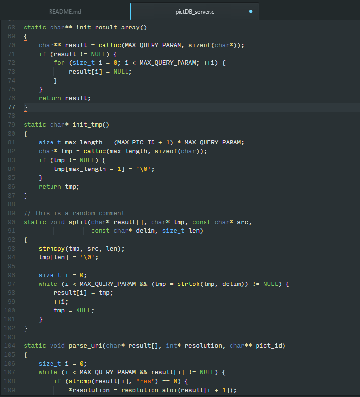
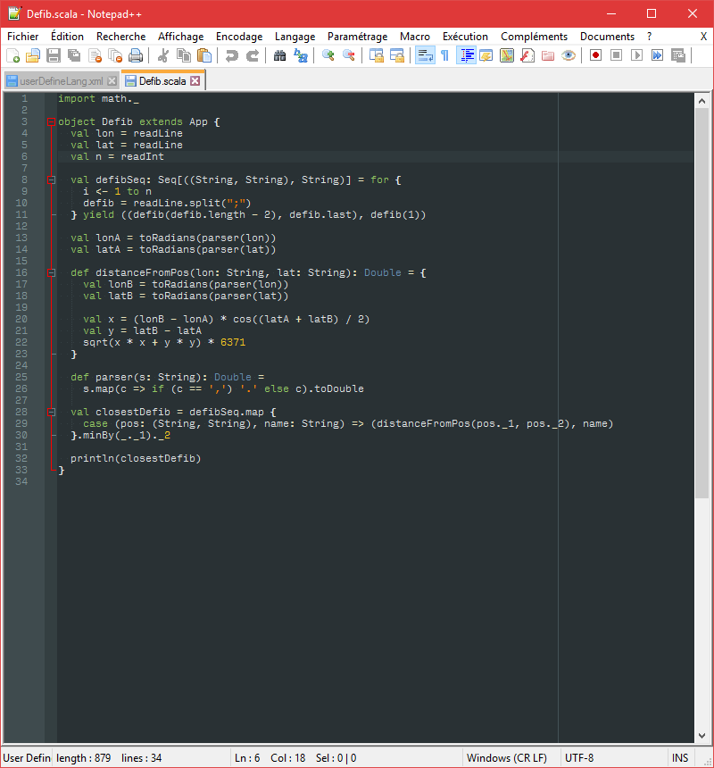
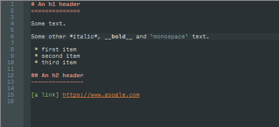

# Obsidian Colors

Obsidian-based theme for Atom, JetBrains IDEs (mainly IntelliJ and Android Studio), and support of
Markdown and Scala for the original Notepad++. This theme adds more colors to the original obsidian theme.

## Installation

### Atom

Go to Settings -> Install, search for obsidian-colors in Themes and click install.

### IntelliJ / Android Studio and other JetBrains IDEs

Two methods:

- Download `jetbrains\obsidian-colors.jar`, import it into your IDE via File -> Import Settings and then select the Editor Colors box.
- Copy the `jetbrains\obsidian-colors.icls` file into the folder `<yourUserName>\.<IDEname>\config\colors` and restart the IDE.

### Notepad++

- If you don't have a user-defined language, just copy the `userDefineLang.xml` file for the language you want into `C:\Users\<yourUserName>\AppData\Roaming\Notepad++`.
- If you do, you need to open the file, copy the part from `<UserLang ...>` to `</UserLang>` and paste it at the end (just before the `</NotepadPlus>`) of your own `userDefineLang.xml` file (located in the same folder as above), then restart Notepad++.

## Screenshots

### Atom

### Android Studio

### Notepad++

- Scala

- Markdown

