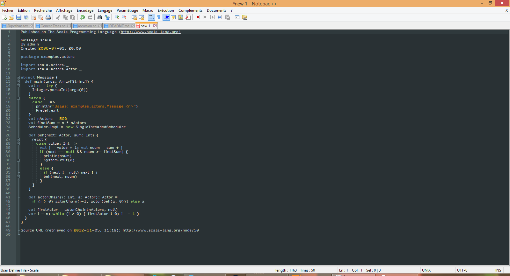
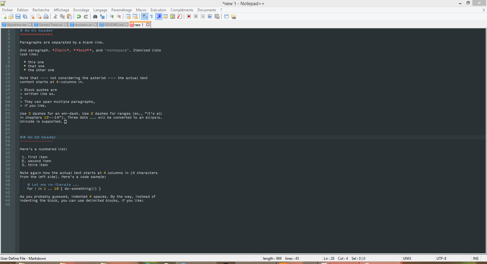

# Scala and Markdown Obsidian Color Scheme for Notepad++

## Introduction

Notepad++ is a great editor, and the obsidian theme is quite nice. Unfortunately, some languages, such as Scala or Markdown (though not a language per se), are not supported by default.
Luckily the developpers thought of everything, and you can actually define your own syntactic color scheme in Notepad++, so here we are!

## Installation

- If you don't have a user-defined language, just copy the userDefineLang.xml file for the language you want into `C:\Users\yourUserName\AppData\Roaming\Notepad++`.
- If you do, you need to open the file (with notepad++ !), copy the part from `<UserLang ...>` to `</UserLang>` and paste it at the end (just before the `</NotepadPlus>`) of your own userDefineLang.xml file (located in the same folder as above), then restart notepad++.

## Warnings and Informations

- The Markdown scheme may behave oddly, in particular if you use asterisks or underscores to draw horizontal lines. I recommend using hyphens for horizontal lines, or separating your symbols with spaces.
- This color scheme is for the obsidian theme, but you could make it work with other themes by modifying the `bgColor` value to the hexadecimal value of the background color of the theme you are using. I cannot guarantee the result though.

## Screenshots

- Scala

- Markdown

